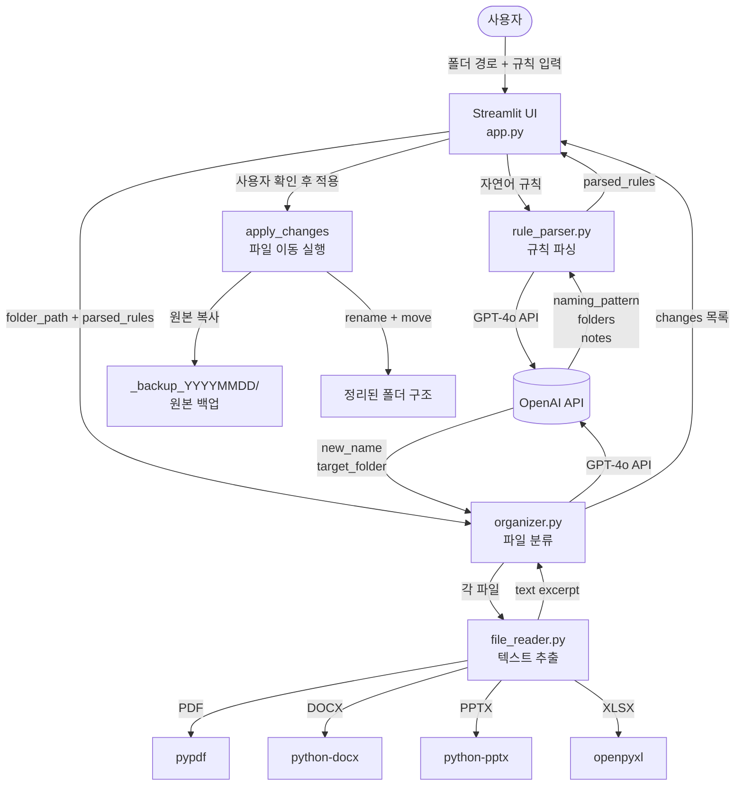
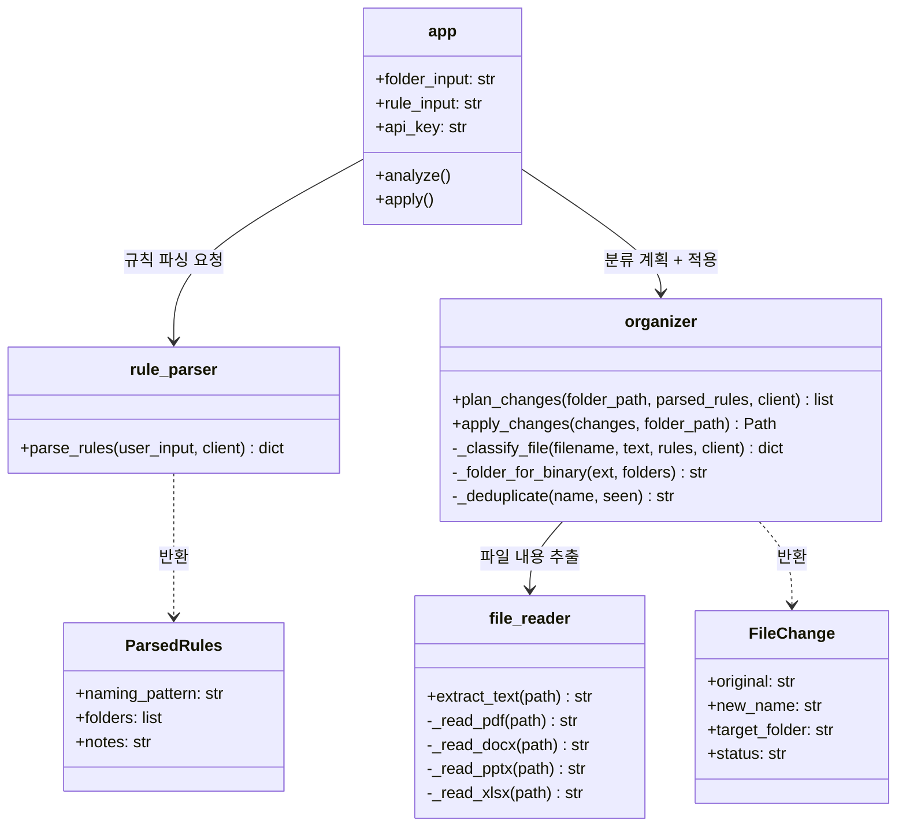

👍👍
# 🗂️ Clean Folder

AI가 파일 내용을 읽고 규칙에 따라 자동으로 **이름 변경 + 폴더 분류**해주는 Streamlit 앱입니다.

## 주요 기능

- 자연어로 정리 규칙 입력 (예: "날짜_주제_출처 형식으로 이름 짓고, 보고서/참고자료/양식/기타로 분류해줘")
- PDF, Word, PowerPoint, Excel, 텍스트 파일 내용 자동 분석
- 변경 사항 미리보기 후 적용
- 원본 파일 자동 백업

## 시작하기

### 1. 패키지 설치

```bash
pip install -r requirements.txt
```

### 2. API Key 설정

`.env.example`을 복사해 `.env` 파일을 만들고 OpenAI API Key를 입력합니다.

```bash
cp .env.example .env
```

```env
OPENAI_API_KEY=sk-...
```

### 3. 앱 실행

```bash
streamlit run app.py
```

브라우저에서 `http://localhost:8501`이 자동으로 열립니다.

## 사용 방법

1. **폴더 경로** 입력 (예: `C:/Users/User/Downloads`)
2. **정리 규칙** 작성 (자연어)
3. **OpenAI API Key** 입력 (`.env`에 설정하면 자동 입력)
4. **분석 시작** 클릭
5. 변경 Preview 확인 후 **적용** 또는 **취소**

## 아키텍처

### 전체 흐름



### 도메인 구조



## 프로젝트 구조

```
├── app.py              # Streamlit 메인 앱
├── core/
│   ├── file_reader.py  # 파일 텍스트 추출 (PDF, DOCX, PPTX, XLSX 등)
│   ├── rule_parser.py  # 자연어 규칙 → JSON 파싱 (GPT-4o)
│   └── organizer.py    # 파일 분류 및 이동 실행
├── requirements.txt
└── .env.example
```

## 지원 파일 형식

| 형식 | 확장자 |
|------|--------|
| 문서 | `.pdf`, `.docx`, `.pptx`, `.xlsx` |
| 텍스트 | `.txt`, `.md`, `.csv`, `.json`, `.py`, `.js` 등 |
| 이미지/동영상 | 확장자 기반 분류 (내용 분석 없음) |

## 주의사항

- 적용 시 원본 파일은 `_backup_YYYYMMDD_HHMMSS` 폴더에 자동 백업됩니다.
- OpenAI API 사용 요금이 발생할 수 있습니다.


## 추가 개발 계획 
1. 관리자 페이지
* 테스트를 cli 기반이 아닌 별도의 ui에서 수행하고 결과를 확인

2. Frontend UI 개선 
* 다크모드 버전 UI 개발 
